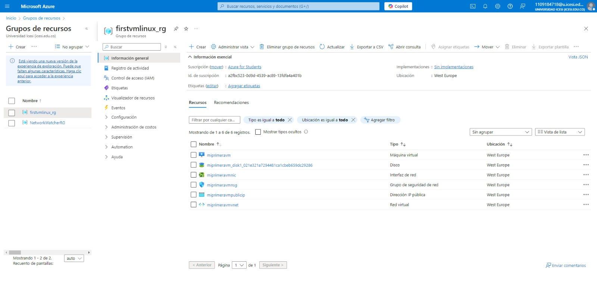

# Despliegue de Recursos con Terraform en Azure

Este documento describe los pasos necesarios para desplegar una Azure Function y una máquina virtual Linux en Azure utilizando Terraform. Se incluyen comandos, imágenes de referencia y una breve explicación de cada paso.

## PARTE 1: Despliegue de AZURE FUNCTION

1. Inicializar Terraform

Antes de comenzar, debemos inicializar Terraform para descargar los proveedores necesarios y preparar el entorno.
```bash
terraform init
```


2. Validar la configuración

Verificamos que la configuración y sintaxis de nuestros archivos de Terraform sean correctas.
```bash
terraform validate
```


3. Ver el plan de ejecución

Este comando nos permite ver un resumen de los cambios que Terraform realizará en la infraestructura antes de aplicarlos.
```bash
terraform plan
```


4. Aplicar los cambios

Ejecutamos el siguiente comando para desplegar la Azure Function en la nube.
```bash
terraform apply
```


Confirmamos con `yes` cuando se nos solicite.

5. Destruir los recursos

Si necesitamos eliminar la infraestructura creada, utilizamos:
```bash
terraform destroy
```


## PARTE 2: DESPLEGAR VM_LINUX CON TERRAFORM

1. Inicializar Terraform

Al igual que en el despliegue anterior, debemos inicializar Terraform.
```bash
terraform init
```


2. Validar la configuración

Revisamos que los archivos de configuración no contengan errores.
```bash
terraform validate
```


3. Ver el plan de ejecución

Obtenemos un resumen de los cambios que se aplicarán en la infraestructura.
```bash
terraform plan
```


4. Aplicar los cambios

Ejecutamos el comando para desplegar la máquina virtual Linux.
```bash
terraform apply
```





Confirmamos con `yes` cuando se nos solicite.


5. Destruir los recursos

Si es necesario eliminar la máquina virtual y otros recursos asociados, ejecutamos:
```bash
terraform destroy
```


